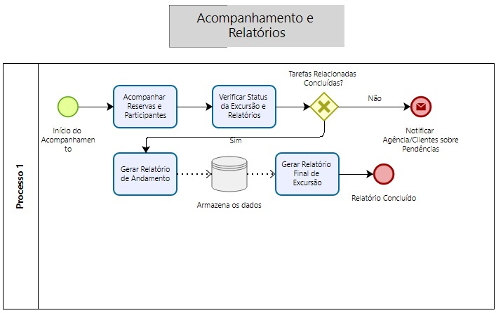

### 3.3.3 Processo 3 – Acompanhamento e Relatorio

Oportunidades de Melhoria
Automatização de Relatórios: Geração automática de relatórios com base nos dados de tarefas concluídas.
Melhoria na Visualização: Implementação de dashboards interativos para facilitar o acompanhamento das tarefas e progresso.
Notificações Automatizadas: Envio de notificações automáticas ao usuário sobre o status das tarefas e prazos importantes.
Integração com Ferramentas Externas: Sincronização de dados de acompanhamento e relatórios com ferramentas de produtividade como Trello ou Asana.

#### Detalhamento das atividades

**Selecionar Opção de Acompanhamento ou Relatório**

| **Campo**       | **Tipo**         | **Restrições** | **Valor default** |
| ---             | ---              | ---            | ---               |
|Opção Selecionada	| Seleção Única  | "Acompanhamento" ou "Relatório"|  "Acompanhamento"  |

| **Comandos**         |  **Destino**                   | **Tipo** |
| ---                  | ---                            | ---               |
| Confirmar Escolha |Gateway Exclusivo (Usuário)  |default |
| Cancelar    | Fim do Processo                               |cancel                   |

**Visualizar Acompanhamento de Tarefas**

| **Campo**       | **Tipo**         | **Restrições** | **Valor default** |
| ---             | ---              | ---            | ---               |
| Progresso das Tarefas| Tabela  | Exibe tarefas e status               |Nenhum                   |
|Detalhes da Tarefa                 | Área de Texto	                 | Descrição das tarefas |  Nenhum |

| **Comandos**         |  **Destino**                   | **Tipo**          |
| ---                  | ---                            | ---               |
| Voltar| Gateway Exclusivo (Usuário)| default |
|  Finalizar Visualização                    |   Evento Final    | 	default |

**Gerar Relatório de Tarefas**

| **Campo**       | **Tipo**         | **Restrições** | **Valor default** |
| ---             | ---              | ---            | ---               |
| Tipo de Relatório | Seleção Única  |  "Resumo" ou "Detalhado"              |"Resumo"                   |
| Data Inicial                |Data                  | Campo obrigatório               |Nenhum                   |
|                 |Data                  | Campo obrigatório               | Nenhum                  |

| **Comandos**         |  **Destino**                   | **Tipo**          |
| ---                  | ---                            | ---               |
| Gerar Relatório | Evento Final  | default |
|Cancelar |       Gateway Exclusivo (Usuário)|cancel |

