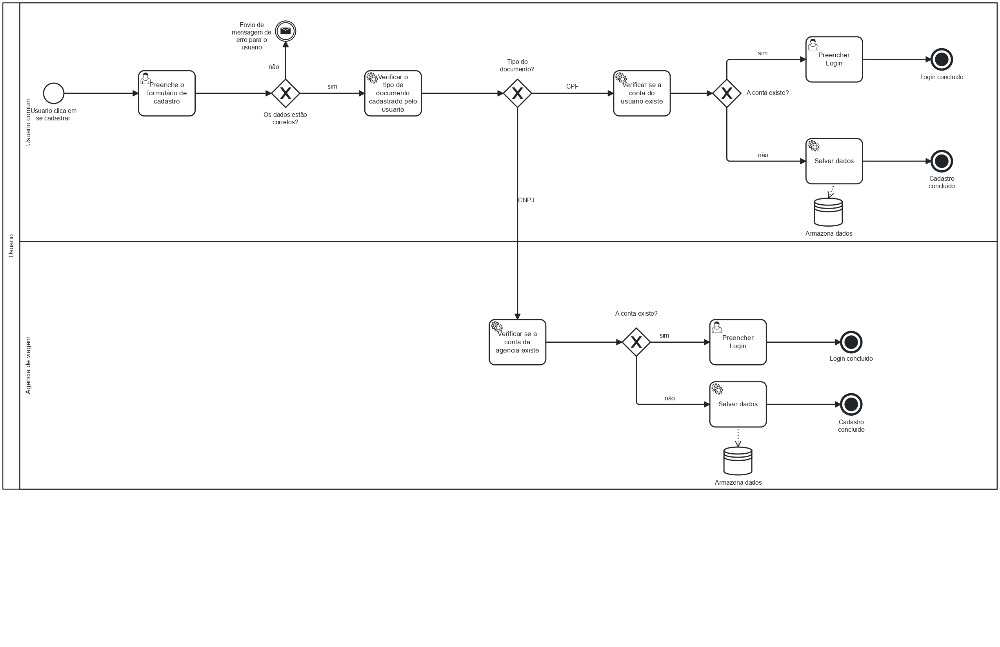

### 3.3.1 Processo 1 – Cadastro de usuário

Estamos aprimorando o processo de cadastro de usuários, e aqui estão as melhorias que implementamos com base no novo modelo BPMN:

Cadastro Simplificado: Agora, o sistema diferencia automaticamente entre usuários comuns e agências de viagem, verificando se é necessário cadastrar CPF ou CNPJ, de forma clara e objetiva.

Validação Automática: O sistema verifica em tempo real se o usuário já possui cadastro, e caso sim, redireciona diretamente para a página de login, tornando o processo mais eficiente.

Processos Automatizados: O fluxo do BPMN otimiza a verificação de dados e o envio de mensagens, garantindo que o sistema responda rapidamente ao usuário, exibindo mensagens de erro ou sucesso conforme necessário.

Experiência de Usuário Fluida: Implementamos um fluxo lógico que permite aos usuários realizar o cadastro de forma intuitiva e sem complicações, garantindo que todos os passos do processo estejam claros e acessíveis.

Essas mudanças visam melhorar a eficiência, segurança e simplicidade no cadastro de usuários, tanto para pessoas físicas quanto para agências de viagem.

#### Detalhamento das atividades

Inserção de Dados Pessoais

| Campo                     | Tipo            | Restrições                                            | Valor Default   |
|---------------------------|-----------------|------------------------------------------------------|------------------|
| Nome Completo             | Caixa de Texto  | Campo obrigatório, apenas texto                      | Nenhum           |
| Endereço de E-mail        | Caixa de Texto  | Formato de e-mail válido, campo obrigatório          | Nenhum           |
| Senha                     | Caixa de Texto  | Formato de senha com regras de complexidade           | Nenhum           |
| CPF/CNPJ        | Caixa de Texto  | Formato texto,campo obrigatorio                         | Nenhum           |
| Aceito os Termos de Uso   | Checkbox        | Campo obrigatório para consentimento                   | Não marcado       |
| Dicas de Preenchimento     | Tooltip         | Dicas para cada campo na inserção                    | N/A              |

#### Comandos

| Comando                   | Destino                             | Tipo     |
|---------------------------|-------------------------------------|----------|
| Criar Conta               | Validar Dados                       | Default  |
| Confirmar Cadastro        | Redirecionar para página de confirmação | Default  |
| Recuperar Senha           | Redirecionar para formulário de recuperação | Default  |

### Confirmação de Cadastro

| **Campo**             | **Tipo**         | **Restrições**                                   | **Valor Default** |
|-----------------------|------------------|-------------------------------------------------|-------------------|
| Status do Cadastro    | Seleção Única    | Deve ser "Aprovado" ou "Rejeitado"               | Rejeitado         |
| Mensagem de Confirmação | Área de Texto  | Deve conter uma mensagem clara sobre o status    | Cadastro Rejeitado|
