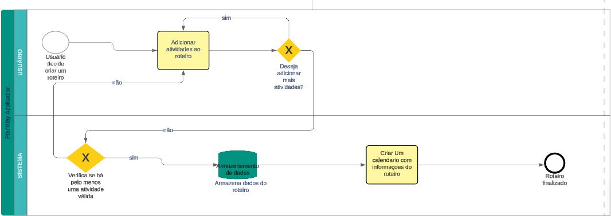

### 3.3.2 Processo 2 – ROTEIRO-CALENDARIO

Oportunidades de Melhoria
Automatização de Processos: Implementação de automação na criação de roteiros e sincronização automática com o calendário do usuário.
Melhoria da Usabilidade: Simplificação da interface para facilitar a criação de eventos e roteiros.
Integração de Notificações: Envio de lembretes automáticos sobre eventos ou alterações no roteiro.
Sincronização Multiplataforma: Permitir a integração com calendários de terceiros (Google Calendar, Outlook, etc.).

#### Detalhamento das atividades

Inserção de Detalhes do Roteiro ou Evento

| **Campo**              | **Tipo**          | **Restrições**                                      | **Valor Default**      |
|------------------------|-------------------|----------------------------------------------------|------------------------|
| Nome do Roteiro         | Caixa de Texto    | Campo obrigatório, apenas texto                    | Nenhum                 |
| Descrição               | Área de Texto     | Máximo de 500 caracteres                           | Nenhum                 |
| Data de Início          | Data              | Campo obrigatório, formato dd-mm-aaaa              | Nenhum                 |
| Hora de Início          | Hora              | Campo obrigatório, formato hh:mm                   | Nenhum                 |
| Data de Término         | Data              | Campo opcional, formato dd-mm-aaaa                 | Nenhum                 |
| Hora de Término         | Hora              | Campo opcional, formato hh:mm                      | Nenhum                 |
| Local                  | Caixa de Texto    | Campo obrigatório, apenas texto                    | Nenhum                 |
| Imagem de Evento        | Imagem            | Campo opcional                                     | Nenhum                 |
| Lembretes               | Seleção Múltipla  | Opções: "1 hora antes", "1 dia antes", "sem lembrete" | Sem lembrete           |

### Comandos

| **Comando**                  | **Destino**                    | **Tipo**    |
|------------------------------|---------------------------------|-------------|
| Adicionar Evento ao Roteiro   | Retorna para Tarefa de Inserção | Default     |
| Finalizar Criação do Roteiro  | Salvar e Sincronizar Calendário | Default     |

### Confirmação de Roteiro Criado

| **Campo**              | **Tipo**          | **Restrições**                                      | **Valor Default**      |
|------------------------|-------------------|----------------------------------------------------|------------------------|
| Status do Roteiro       | Seleção Única     | "Criado com sucesso" ou "Erro ao criar roteiro"     | Erro ao criar roteiro   |
| Mensagem de Confirmação | Área de Texto     | Mensagem com detalhes do status do roteiro          | Roteiro criado com sucesso! |

### Comandos

| **Comando**            | **Destino**            | **Tipo**    |
|------------------------|------------------------|-------------|
| Finalizar              | Página Inicial          | Default     |
| Editar Roteiro         | Retornar para edição    | Cancel      |
