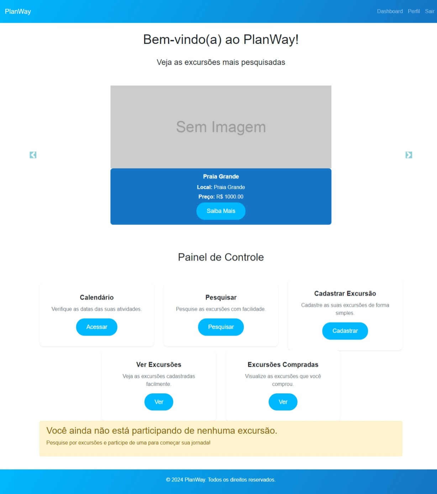
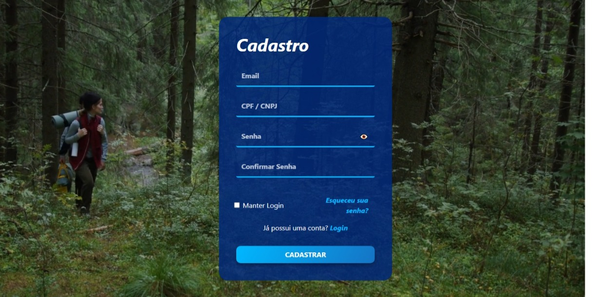
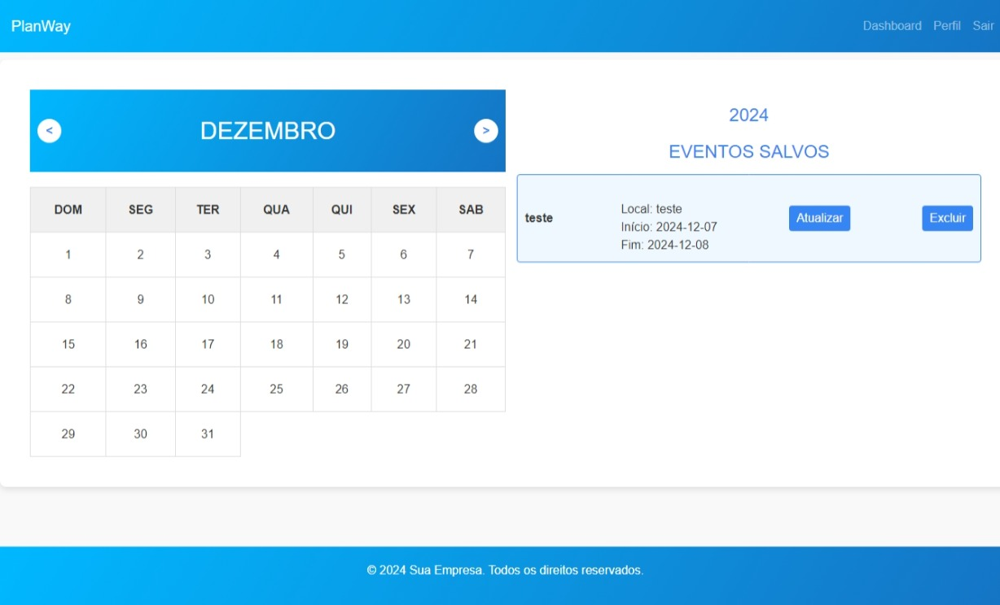
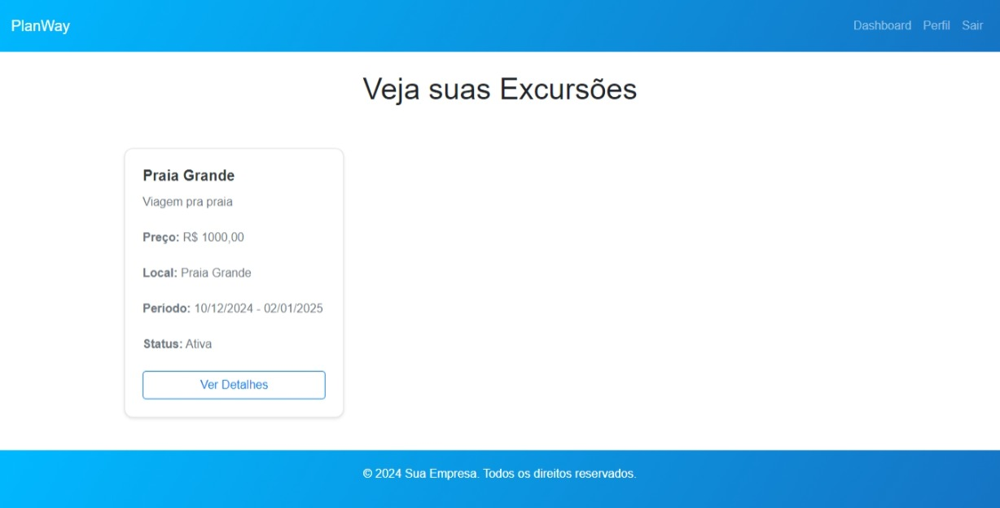
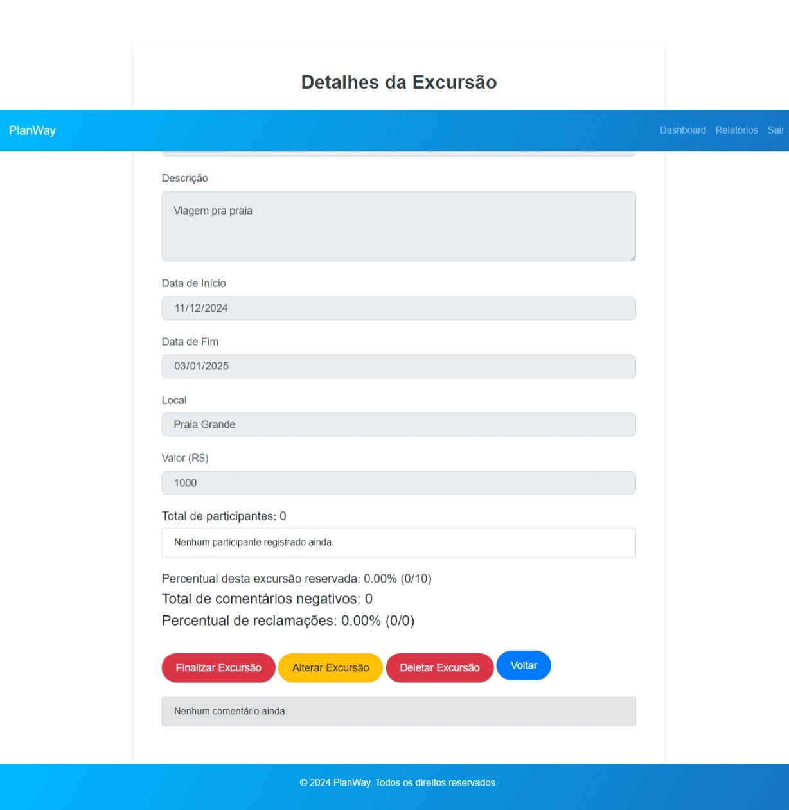
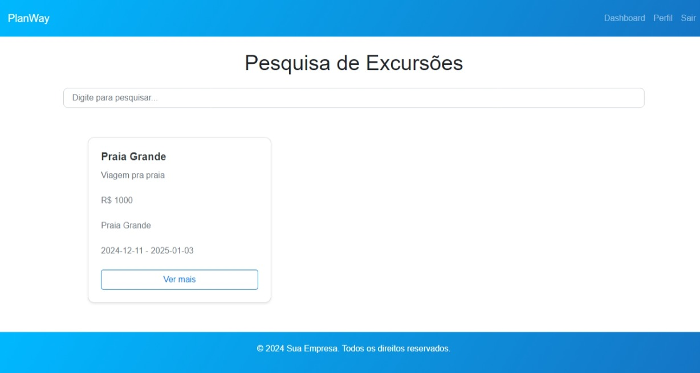
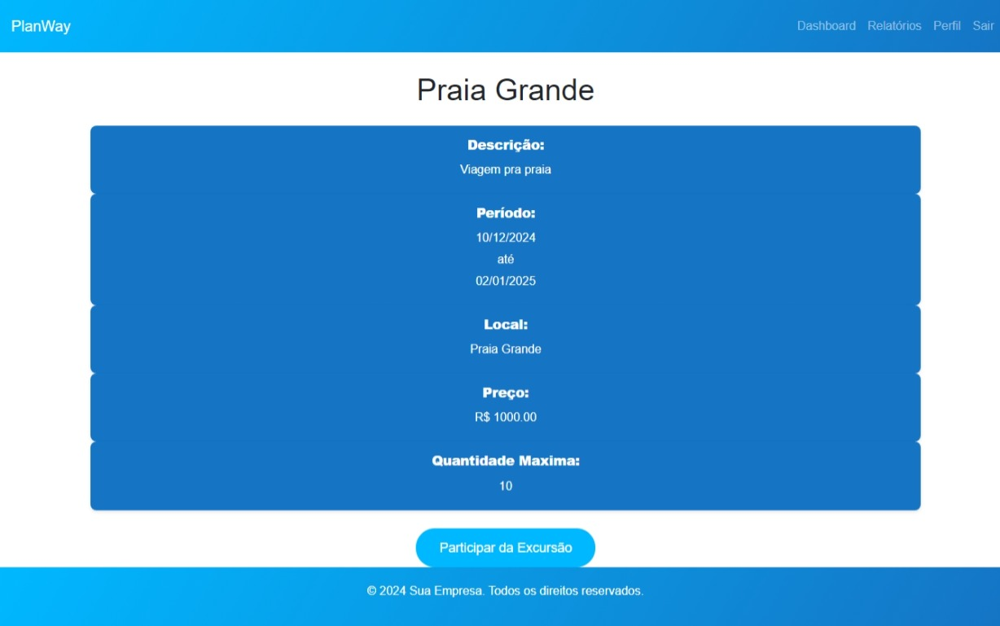

## 6. Interface do sistema

_Visão geral da interação do usuário por meio das telas do sistema. Apresente as principais interfaces da plataforma._

## 6.1. Tela principal do sistema

Essa página é o Painel de Controle (Dashboard) do sistema PlanWay, projetado para gestão e pesquisa de excursões. Ela inclui as seguintes seções:

Barra de Navegação (Navbar):

Links para o Dashboard, o Perfil do usuário e um botão de Sair.
Mensagem de Boas-Vindas:

Uma saudação ao usuário, com o texto "Bem-vindo(a) ao PlanWay!", exibida logo no início.
Carrossel de Excursões:

Um carrossel interativo mostrando as excursões mais pesquisadas, com indicadores e controles para navegação entre as opções.
Seções Principais:

Calendário: Acesso para ver as datas das atividades.
Pesquisar: Permite buscar por novas excursões.
Cadastrar Excursão: Opção para cadastrar novas excursões.
Ver Excursões: Exibe as excursões cadastradas.
Excursões Compradas: Mostra as excursões adquiridas pelo usuário.

## 6.2. Telas do processo 1

Preencher o formulário de login:

Email: O usuário deve informar seu endereço de e-mail no campo correspondente.
CPF/CNPJ: O usuário deve preencher o campo de CPF ou CNPJ, dependendo da sua categoria.
Senha: O usuário precisa digitar sua senha no campo de senha.
Manter Login: Se desejar manter-se logado em futuras visitas, o usuário pode marcar a opção "Manter Login".
Após preencher o formulário, o usuário deve clicar no botão "Entrar" para acessar a plataforma.

## 6.3. Telas do processo 2

Adicionar eventos: O usuário pode cadastrar eventos clicando em um botão para abrir um modal onde ele pode preencher as seguintes informações:

Título do evento.
Data de início.
Data de fim.
Local do evento. Após preencher, o usuário pode salvar o evento, que será registrado e exibido na lista de eventos salvos.

## 6.3. Telas do processo 3

A agência vai para a página "Veja suas Excursoes" e visualiza as excursoes que ele criou

A segunda atividade é clicar em ver detalhes, o usuario sera direcionado para uma pagina com as informações da excursão e com botões de deletar, finalizar, alterar e voltar. Se ele decide alterar os campos input serão "abertos" para ele alterar a sua excursão.Caso ele queira deletar pode somente clicar no botão, e fazer o mesmo para finalizar.

## 6.3. Telas do processo 4

O usuario irá clicar em pesquisa na pagina principal, e irá ser direcionado para essa página

A segunda atividade é clicar em ver detalhes, o usuario sera direcionado para uma pagina com as informações da excursão e terá um botão de participar da excursão, basta ele clicar para participar e será redirecionado para a pagina principal

## 6.3. Telas do processo 5

Nessa tela, o usuário realiza o cadastro de uma excursão. Ele deve preencher um formulário com as seguintes informações:

Nome da Excursão: Campo obrigatório para inserir o nome da excursão (ex: "Praia Grande").

Descrição: Campo obrigatório para descrever a excursão (ex: "Ir para a praia").

Data de Início: Campo obrigatório para selecionar a data de início da excursão.

Data de Fim: Campo obrigatório para selecionar a data de fim da excursão.

Local: Campo obrigatório para informar o local da excursão (ex: "Rio de Janeiro").

Valor: Campo obrigatório para inserir o valor da excursão em reais (R$), com um formato específico de valor monetário (ex: R$600,00).

Serviços Adicionais: Campo opcional para listar serviços extras que fazem parte da excursão (ex: "Guia turístico, Transporte").

Quantidade Máxima de Pessoas: Campo obrigatório para informar o número máximo de pessoas que podem participar da excursão (ex: "10").

.jpeg)

